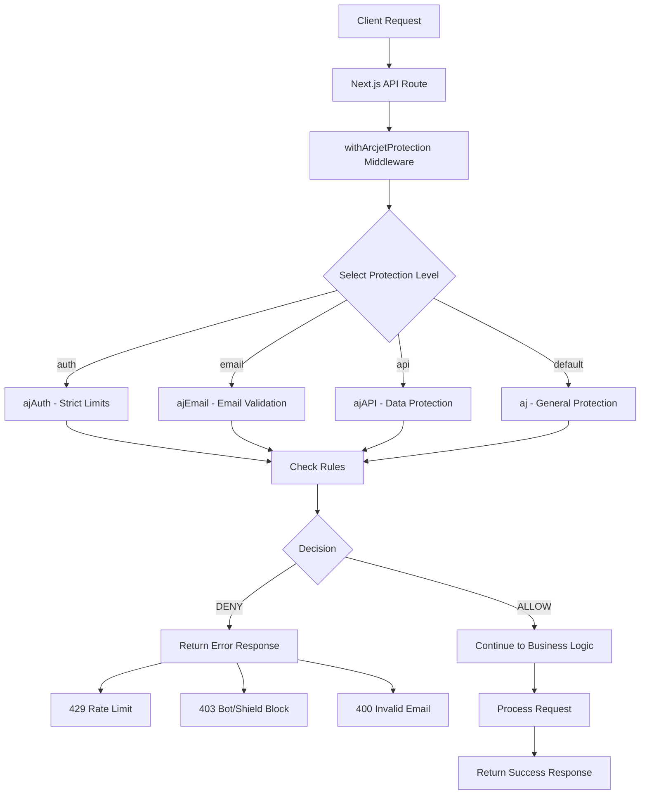

# 🛡️ Arcjet Security Protection Guide - VeroScale App

## Overview

Dokumentasi lengkap tentang implementasi Arcjet security protection di aplikasi VeroScale untuk melindungi API endpoints dari berbagai ancaman keamanan seperti rate limiting, bot detection, dan serangan umum.

## 📁 File Structure & Components

### 🔧 Core Arcjet Files

- **`lib/arcjet.ts`** - Konfigurasi utama Arcjet dengan berbagai tingkat proteksi
- **`lib/arcjet-middleware.ts`** - Middleware wrapper untuk implementasi Arcjet
- **`package.json`** - Dependency `@arcjet/next: ^1.0.0-beta.9`

### 🚀 Protected API Endpoints

- **`pages/api/auth/login.ts`** - Login endpoint dengan proteksi "auth"
- **`pages/api/auth/register.ts`** - Register endpoint dengan proteksi "email"
- **`pages/api/reports/generate.ts`** - Report generation dengan proteksi "api"
- **`pages/api/reports/templates.ts`** - Report templates dengan proteksi "api"
- **`pages/api/weights/index.ts`** - Weight data dengan proteksi "api"
- **`pages/api/dashboard.ts`** - Dashboard data dengan proteksi "api"

---

## 🔒 Arcjet Protection Levels

### 1. **Default Protection** (`aj`)

_File: `lib/arcjet.ts` (lines 1-22)_

```typescript
export const aj = arcjet({
  key: process.env.ARCJET_KEY!,
  rules: [
    // Rate limiting: 100 requests per 15 minutes
    fixedWindow({
      mode: "LIVE",
      window: "15m",
      max: 100,
    }),
    // Bot detection dengan exception untuk search engines
    detectBot({
      mode: "LIVE",
      allow: ["CATEGORY:SEARCH_ENGINE"],
    }),
    // Shield protection terhadap serangan umum
    shield({
      mode: "LIVE",
    }),
  ],
});
```

**Features:**

- ✅ **Rate Limiting**: 100 requests/15 menit
- ✅ **Bot Detection**: Block bots, allow search engines
- ✅ **Shield Protection**: Proteksi terhadap serangan umum

---

### 2. **Authentication Protection** (`ajAuth`)

_File: `lib/arcjet.ts` (lines 24-39)_

```typescript
export const ajAuth = arcjet({
  key: process.env.ARCJET_KEY!,
  rules: [
    // Stricter rate limiting: 20 attempts per 15 minutes
    fixedWindow({
      mode: "LIVE",
      window: "15m",
      max: 20,
    }),
    // No bot exceptions for auth endpoints
    detectBot({
      mode: "LIVE",
      allow: [],
    }),
    shield({
      mode: "LIVE",
    }),
  ],
});
```

**Features:**

- 🔐 **Strict Rate Limiting**: 20 requests/15 menit (lebih ketat)
- 🚫 **No Bot Allowance**: Block semua bot tanpa exception
- 🛡️ **Shield Protection**: Proteksi ekstra untuk auth

**Used in:**

- `pages/api/auth/login.ts` - Prevent brute force attacks

---

### 3. **Email Validation Protection** (`ajEmail`)

_File: `lib/arcjet.ts` (lines 41-54)_

```typescript
export const ajEmail = arcjet({
  key: process.env.ARCJET_KEY!,
  rules: [
    // Email validation dengan blocking disposable emails
    validateEmail({
      mode: "LIVE",
      block: ["DISPOSABLE", "INVALID"],
    }),
    // Conservative rate limiting: 10 attempts per hour
    fixedWindow({
      mode: "LIVE",
      window: "1h",
      max: 10,
    }),
  ],
});
```

**Features:**

- 📧 **Email Validation**: Block disposable & invalid emails
- ⏱️ **Hourly Rate Limit**: 10 registrations/jam
- 🚫 **Quality Control**: Mencegah spam registrations

**Used in:**

- `pages/api/auth/register.ts` - Validate email quality during registration

---

### 4. **API Data Protection** (`ajAPI`)

_File: `lib/arcjet.ts` (lines 56-69)_

```typescript
export const ajAPI = arcjet({
  key: process.env.ARCJET_KEY!,
  rules: [
    // Higher rate limit untuk data operations
    fixedWindow({
      mode: "LIVE",
      window: "1h",
      max: 200,
    }),
    // Block bots dari data access
    detectBot({
      mode: "LIVE",
      allow: [],
    }),
  ],
});
```

**Features:**

- 📊 **Data Rate Limiting**: 200 requests/jam untuk data operations
- 🤖 **Bot Protection**: Block automated data scraping
- 🔄 **Balanced Access**: Allow normal usage, prevent abuse

**Used in:**

- `pages/api/reports/*` - Protect report generation
- `pages/api/weights/*` - Protect weight data access
- `pages/api/dashboard.ts` - Protect dashboard data

---

## 🛠️ Middleware Implementation

### **Arcjet Middleware Wrapper**

_File: `lib/arcjet-middleware.ts` (lines 1-60)_

```typescript
export type ArcjetProtectionLevel = "default" | "auth" | "email" | "api";

export async function withArcjetProtection(
  req: NextApiRequest,
  res: NextApiResponse,
  level: ArcjetProtectionLevel = "default"
) {
  // Select appropriate Arcjet instance
  let arcjetInstance;

  switch (level) {
    case "auth":
      arcjetInstance = ajAuth; // Strict auth protection
      break;
    case "email":
      arcjetInstance = ajEmail; // Email validation
      break;
    case "api":
      arcjetInstance = ajAPI; // Data API protection
      break;
    default:
      arcjetInstance = aj; // Default protection
  }

  // Execute protection
  const decision = await arcjetInstance.protect(req);

  if (decision.isDenied()) {
    // Handle different denial reasons
    for (const result of decision.results) {
      if (result.reason.isRateLimit()) {
        return res.status(429).json({
          error: "Too many requests",
          message: "Rate limit exceeded. Please try again later.",
          retryAfter: result.reason.resetTime,
        });
      }

      if (result.reason.isBot()) {
        return res.status(403).json({
          error: "Bot detected",
          message: "Automated requests are not allowed.",
        });
      }

      if (result.reason.isEmail()) {
        return res.status(400).json({
          error: "Invalid email",
          message: "Please provide a valid email address.",
        });
      }

      if (result.reason.isShield()) {
        return res.status(403).json({
          error: "Security violation",
          message: "Request blocked for security reasons.",
        });
      }
    }
  }

  return null; // Allow request to continue
}
```

---

## 🔗 Integration Examples

### 1. **Login Protection**

_File: `pages/api/auth/login.ts` (lines 15-17)_

```typescript
export default async function handler(
  req: NextApiRequest,
  res: NextApiResponse
) {
  if (req.method !== "POST") {
    return res.status(405).json({ message: "Method not allowed" });
  }

  // Apply Arcjet protection for auth endpoints (20 requests per 15 minutes)
  const arcjetResult = await withArcjetProtection(req, res, "auth");
  if (arcjetResult) return arcjetResult;

  try {
    const { email, password } = req.body;
    // ... login logic continues
  } catch (error) {
    // ... error handling
  }
}
```

**Protection Applied:**

- 🔐 **Rate Limiting**: Max 20 login attempts/15 menit
- 🚫 **Bot Blocking**: Prevent automated attacks
- 🛡️ **Shield**: General security protection

---

### 2. **Registration Protection**

_File: `pages/api/auth/register.ts` (lines 15-17)_

```typescript
export default async function handler(
  req: NextApiRequest,
  res: NextApiResponse
) {
  if (req.method !== "POST") {
    return res.status(405).json({ message: "Method not allowed" });
  }

  // Apply Arcjet protection with email validation
  const arcjetResult = await withArcjetProtection(req, res, "email");
  if (arcjetResult) return arcjetResult;

  try {
    // Only admin can register new users
    const user = await getUserFromToken(req);
    if (!user || !isAdmin(user)) {
      return res.status(403).json({ message: "Unauthorized" });
    }

    const { name, email, password, role } = req.body;
    // ... registration logic continues
  } catch (error) {
    // ... error handling
  }
}
```

**Protection Applied:**

- 📧 **Email Validation**: Block disposable/invalid emails
- ⏱️ **Rate Limiting**: Max 10 registrations/jam
- ✅ **Quality Control**: Ensure legitimate registrations

---

### 3. **API Data Protection**

_File: `pages/api/reports/generate.ts` (lines 15-17)_

```typescript
export default async function handler(
  req: NextApiRequest,
  res: NextApiResponse
) {
  if (req.method !== "GET") {
    return res.status(405).json({ message: "Method not allowed" });
  }

  // Apply Arcjet protection for API endpoints
  const arcjetResult = await withArcjetProtection(req, res, "api");
  if (arcjetResult) return arcjetResult;

  try {
    // Get user from token
    const user = await getUserFromToken(req);
    if (!user) {
      return res.status(401).json({ message: "Authentication required" });
    }

    // ... report generation logic continues
  } catch (error) {
    // ... error handling
  }
}
```

**Protection Applied:**

- 📊 **Data Rate Limiting**: Max 200 requests/jam
- 🤖 **Bot Prevention**: Block automated scraping
- 🔄 **Balanced Access**: Allow legitimate usage

---

## 🚨 Error Response Handling

### **Rate Limit Exceeded (429)**

```json
{
  "error": "Too many requests",
  "message": "Rate limit exceeded. Please try again later.",
  "retryAfter": "2024-08-14T15:30:00.000Z"
}
```

### **Bot Detected (403)**

```json
{
  "error": "Bot detected",
  "message": "Automated requests are not allowed."
}
```

### **Invalid Email (400)**

```json
{
  "error": "Invalid email",
  "message": "Please provide a valid email address."
}
```

### **Security Shield (403)**

```json
{
  "error": "Security violation",
  "message": "Request blocked for security reasons."
}
```

---

## 📊 Protection Matrix

| Endpoint Type    | Protection Level | Rate Limit | Window | Bot Detection     | Email Validation      | Shield |
| ---------------- | ---------------- | ---------- | ------ | ----------------- | --------------------- | ------ |
| **General**      | `default`        | 100 req    | 15 min | ✅ (allow search) | ❌                    | ✅     |
| **Auth Login**   | `auth`           | 20 req     | 15 min | ✅ (strict)       | ❌                    | ✅     |
| **Registration** | `email`          | 10 req     | 1 hour | ❌                | ✅ (block disposable) | ❌     |
| **API Data**     | `api`            | 200 req    | 1 hour | ✅ (strict)       | ❌                    | ❌     |

---

## 🔧 Configuration & Environment

### **Environment Variables**

```env
# Arcjet Configuration
ARCJET_KEY=your-arcjet-api-key-here

# Mode Configuration (LIVE or DRY_RUN)
# LIVE mode blocks requests, DRY_RUN mode logs only
```

### **Package Dependencies**

_File: `package.json`_

```json
{
  "dependencies": {
    "@arcjet/next": "^1.0.0-beta.9"
  }
}
```

---

## 🛡️ Security Benefits

### **🔐 Brute Force Protection**

- **Login Attempts**: Limited to 20/15 minutes
- **Progressive Blocking**: Automatic IP blocking on violations
- **Attack Prevention**: Stops credential stuffing attacks

### **🤖 Bot & Automation Protection**

- **Legitimate Traffic**: Allow search engines for SEO
- **Block Scrapers**: Prevent data harvesting bots
- **API Protection**: Stop automated abuse of data endpoints

### **📧 Email Quality Control**

- **Disposable Email Blocking**: Prevent temporary email services
- **Invalid Email Detection**: Block malformed email addresses
- **Registration Quality**: Ensure legitimate user registrations

### **🛡️ General Security Shield**

- **Common Attack Vectors**: SQL injection, XSS attempts
- **Malicious Payloads**: Automatic detection and blocking
- **Security Headers**: Proper security response headers

---

## 📈 Monitoring & Analytics

### **Built-in Metrics**

- ✅ **Request Volume**: Track API usage patterns
- ✅ **Block Rate**: Monitor protection effectiveness
- ✅ **Attack Attempts**: Log security violations
- ✅ **Performance Impact**: Measure latency overhead

### **Custom Logging**

```typescript
// Example: Custom logging in middleware
if (decision.isDenied()) {
  console.log(`Arcjet blocked request: ${result.reason.toString()}`);

  // Optional: Send to external monitoring
  // await sendToMonitoring({
  //   type: 'arcjet_block',
  //   reason: result.reason.toString(),
  //   ip: req.ip,
  //   timestamp: new Date().toISOString()
  // });
}
```

---

## 🚀 Implementation Best Practices

### **1. Gradual Rollout**

```typescript
// Start with DRY_RUN mode for testing
fixedWindow({
  mode: "DRY_RUN", // Change to LIVE when ready
  window: "15m",
  max: 100,
});
```

### **2. Appropriate Protection Levels**

- **Authentication**: Use `auth` level for login/logout
- **Registration**: Use `email` level for user creation
- **Data APIs**: Use `api` level for business data
- **Public**: Use `default` level for general endpoints

### **3. Error Handling**

```typescript
// Always handle Arcjet response properly
const arcjetResult = await withArcjetProtection(req, res, "auth");
if (arcjetResult) return arcjetResult; // Stop processing if blocked

// Continue with business logic only if allowed
// ...
```

### **4. Rate Limit Tuning**

- **Monitor Usage**: Track legitimate user patterns
- **Adjust Limits**: Increase if blocking legitimate users
- **Business Logic**: Consider user roles for different limits

---

## 🔄 Integration Flow



---

## 📋 Summary

### **🛡️ Key Protection Features:**

✅ **Multi-Level Protection** - 4 tingkat proteksi sesuai kebutuhan  
✅ **Rate Limiting** - Flexible limits per endpoint type  
✅ **Bot Detection** - Smart bot filtering dengan exceptions  
✅ **Email Validation** - Quality control untuk registrations  
✅ **Shield Protection** - Automatic common attack prevention  
✅ **Easy Integration** - Simple middleware wrapper

### **🔒 Security Coverage:**

🛡️ **Brute Force Attacks** - Login attempt limiting  
🛡️ **Data Scraping** - API rate limiting & bot detection  
🛡️ **Spam Registration** - Email validation & hourly limits  
🛡️ **DDoS Mitigation** - Request rate controls  
🛡️ **Common Exploits** - Shield protection against known attacks

### **📊 Monitoring Capabilities:**

📈 **Real-time Protection** - Immediate request blocking  
📈 **Analytics Dashboard** - Usage and attack metrics  
📈 **Custom Logging** - Integration dengan monitoring tools  
📈 **Performance Tracking** - Latency impact measurement

Arcjet provides comprehensive, easy-to-implement security protection that scales with the VeroScale application while maintaining excellent user experience for legitimate users.
