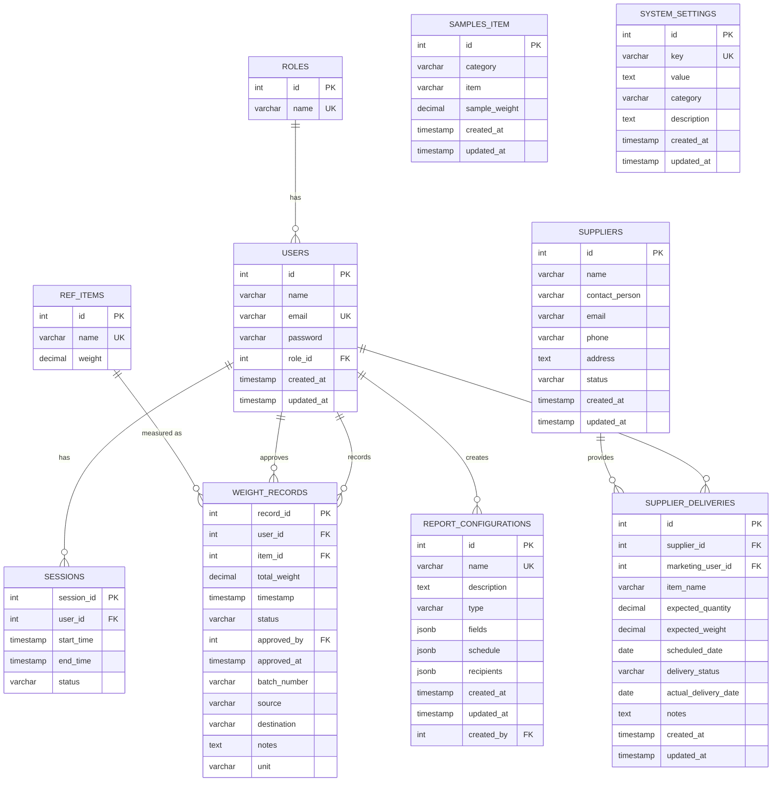

# Weight Management System - Entity Relationship Diagram

## Entity Descriptions

1. **ROLES**: Defines user roles in the system (admin, manager, operator, marketing)
2. **USERS**: Stores user information and their assigned roles
3. **REF_ITEMS**: Reference items with their standard weights
4. **WEIGHT_RECORDS**: Records of weight measurements with approval workflow
5. **SESSIONS**: User login sessions tracking
6. **SAMPLES_ITEM**: Sample items categorized by material type with their sample weights
7. **SUPPLIERS**: Information about material suppliers
8. **SUPPLIER_DELIVERIES**: Scheduled and actual deliveries from suppliers
9. **REPORT_CONFIGURATIONS**: Configurations for generating various reports
10. **SYSTEM_SETTINGS**: System-wide configuration settings

## Key Business Processes

1. **Weight Recording**: Operators record weights of materials using reference items or samples
2. **Approval Workflow**: Managers approve or reject weight records
3. **Supplier Management**: Managing suppliers and their deliveries
4. **Batch Processing**: Grouping weight records into batches
5. **Reporting**: Generating reports based on configured templates
6. **User Session Management**: Tracking user login sessions