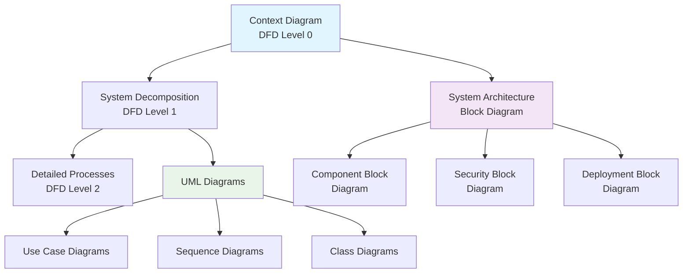

# 📊 Weight Management System - Diagrams Documentation

## 📋 Table of Contents

1. [Overview](#overview)
2. [Data Flow Diagrams (DFD)](#data-flow-diagrams-dfd)
3. [Block Diagrams](#block-diagrams)
4. [UML Diagrams](#uml-diagrams)
5. [Implementation Guide](#implementation-guide)
6. [References](#references)

---

## 🎯 Overview

This document provides comprehensive visual documentation for the **Weight Management System**. It includes data flow diagrams, block diagrams, and architectural views that illustrate how the system processes data, manages components, and ensures security.

### System Purpose

The Weight Management System is designed to:

- 📏 **Record Weight Data** from manual input and IoT devices
- ✅ **Manage Approval Workflows** for weight records
- 🏢 **Handle Supplier Management** and delivery coordination
- 📊 **Generate Reports** for various stakeholders
- 🔒 **Ensure Security** and data integrity

---

## 📈 Data Flow Diagrams (DFD)

### DFD Level 0 - Context Diagram

**Purpose**: Shows the system as a single process with external entities

**External Entities**:

- 👤 **Operator**: Inputs weight data, receives confirmations
- 👤 **Manager**: Makes approval decisions, receives reports
- 📡 **IoT Devices**: Provides automatic measurements
- 👤 **Marketing**: Manages supplier information
- 🏢 **Suppliers**: Handles delivery confirmations

**Key Data Flows**:

- Weight data input from operators and IoT devices
- Approval decisions and report generation
- Supplier coordination and delivery management

---

### DFD Level 1 - System Decomposition

**Purpose**: Breaks down the system into four main processes

**Main Processes**:

1. **1️⃣ Weight Recording** - Captures and stores weight data
2. **2️⃣ Weight Approval** - Manages approval workflow
3. **3️⃣ Supplier Management** - Handles supplier coordination
4. **4️⃣ Report Generation** - Creates reports for stakeholders

**Data Stores**:

- 📊 **Weight Records**: Primary weight data storage
- 🏢 **Suppliers DB**: Supplier information database
- 🚚 **Deliveries**: Delivery tracking database

---

### DFD Level 2 - Detailed Processes

#### Weight Recording Process (1.1 - 1.3)

- **1.1 Capture Weight**: Collects data from manual input and IoT devices
- **1.2 Validate Weight**: Ensures data quality and accuracy
- **1.3 Save Record**: Stores validated data to database

#### Weight Approval Process (2.1 - 2.4)

- **2.1 View Records**: Displays pending records to managers
- **2.2 Analyze Record**: Provides analysis tools for decision making
- **2.3 Make Decision**: Processes approval or rejection
- **2.4 Notify Users**: Sends notifications to relevant users

---

## 🏗️ Block Diagrams

### 1. System Architecture Block Diagram

**Purpose**: Shows the layered architecture of the system

**Architecture Layers**:

```
🖥️ Frontend Layer
    ↓
🔌 API Gateway Layer
    ↓
⚙️ Business Logic Layer
    ↓
🔗 Integration Layer
    ↓
🗄️ Data Layer
```

**Components per Layer**:

- **Frontend**: User Interface, Dashboard, Mobile App
- **API Gateway**: Authentication, Routing, Validation
- **Business Logic**: Weight Service, Approval Service, Report Service
- **Integration**: IoT Connector, Supplier API, Notifications
- **Data**: Primary Database, Cache Layer, Backup Database

---

### 2. Component Block Diagram

**Purpose**: Shows how different user groups interact with system modules

**User Groups**:

- 👥 **Operators**: Production floor staff
- 👔 **Managers**: Decision makers at different levels
- 📡 **IoT Devices**: Smart scales, RFID readers, sensors
- 🌐 **External Systems**: Supplier portals, ERP, WMS

**Core System Modules**:

- 📥 **Input Module**: Manual entry, auto capture, validation
- ⚙️ **Processing Module**: Calculations, approval engine, business rules
- 💾 **Storage Module**: Records, audit trail, configurations
- 📤 **Output Module**: Reports, notifications, API responses

---

### 3. Data Flow Block Diagram

**Purpose**: Illustrates the data processing pipeline

**Processing Stages**:

1. **📊 Collection & Normalization**: Gather and standardize data
2. **✅ Validation & Enrichment**: Verify and enhance data quality
3. **⚙️ Calculations & Aggregation**: Process and summarize data

**Input Sources**: Manual entry, IoT measurements, supplier data
**Outputs**: Dashboards, reports, alerts

---

### 4. Security Block Diagram

**Purpose**: Shows multi-layered security architecture

**Security Layers**:

```
🛡️ Perimeter Security (Firewall, WAF, DDoS Protection)
    ↓
🔐 Application Security (Authentication, Authorization, Sessions)
    ↓
💾 Data Security (Encryption, Backup, Audit Logging)
    ↓
👁️ Security Monitoring (SIEM, IDS/IPS, Vulnerability Scanning)
```

---

### 5. Deployment Block Diagram

**Purpose**: Shows production environment structure

**Infrastructure Components**:

- ⚖️ **Load Balancers**: Primary and secondary for high availability
- 🖥️ **Application Servers**: Multiple servers for scalability
- ⚙️ **Microservices**: Weight, approval, report, notification services
- 🗄️ **Database Cluster**: Primary with read replicas
- 💾 **Storage**: Object storage and backup systems
- 📊 **Monitoring**: Metrics, logs, and alerting infrastructure

---

## 🔄 UML Diagrams

### Available UML Diagrams

The system includes the following UML diagrams (referenced from existing files):

1. **📋 Use Case Diagram** - `use-case-diagram.puml`
2. **🏗️ Class Diagram** - `class-diagram.puml`
3. **🔧 Component Diagram** - `component-diagram.puml`
4. **🌐 Deployment Diagram** - `deployment-diagram.puml`
5. **🔄 Sequence Diagrams**:
   - Weight Recording - `sequence-diagram-weight-recording.puml`
   - Weight Approval - `sequence-diagram-weight-approval.puml`
6. **📊 Activity Diagrams**:
   - Supplier Delivery - `activity-diagram-supplier-delivery.puml`
   - Weight Recording - `activity-diagram-weight-recording.puml`
7. **🔄 State Diagrams**:
   - Delivery States - `state-diagram-delivery.puml`
   - Weight Record States - `state-diagram-weight-record.puml`

---

## 🚀 Implementation Guide

### Phase 1: Core Infrastructure

1. **Database Setup**: Implement primary database with basic tables
2. **API Gateway**: Set up authentication and basic routing
3. **Security Layer**: Implement basic security controls

### Phase 2: Core Functionality

1. **Weight Recording**: Manual input and basic validation
2. **IoT Integration**: Connect smart scales and sensors
3. **Basic Approval**: Simple approval workflow

### Phase 3: Advanced Features

1. **Advanced Analytics**: Reporting and dashboard
2. **Supplier Management**: Full supplier coordination
3. **Mobile Application**: Mobile interface for operators

### Phase 4: Optimization

1. **Performance Tuning**: Optimize database and caching
2. **Advanced Security**: Implement comprehensive security monitoring
3. **Scalability**: Load balancing and horizontal scaling

---

## 📊 Diagram Relationships

### How Diagrams Connect



### Diagram Usage Matrix

| Stakeholder           | Context DFD  | Level 1 DFD  | Level 2 DFD | Block Diagrams  | UML Diagrams |
| --------------------- | ------------ | ------------ | ----------- | --------------- | ------------ |
| **Business Owners**   | ✅ Primary   | ✅ Secondary | ❌          | ✅ Architecture | ❌           |
| **System Architects** | ✅ Secondary | ✅ Primary   | ✅ Primary  | ✅ Primary      | ✅ Secondary |
| **Developers**        | ❌           | ✅ Secondary | ✅ Primary  | ✅ Secondary    | ✅ Primary   |
| **DevOps Engineers**  | ❌           | ❌           | ❌          | ✅ Deployment   | ❌           |
| **Security Team**     | ❌           | ❌           | ❌          | ✅ Security     | ❌           |

---

## 🔍 References

### Documentation Files

- 📄 **Main DFD Documentation**: `data-flow-diagrams.md`
- 🎨 **Visual Diagrams**: `visual-data-flow-diagrams.md`
- 🏗️ **UML Documentation**: `README-UML.md`
- 📊 **Entity Relationship**: `erd-diagram.md`

### PlantUML Files

- 📁 **Location**: `/docs/` directory
- 🔧 **Format**: `.puml` files
- 🖼️ **Rendering**: Can be rendered in VS Code with PlantUML extension

### Integration Documentation

- 📡 **IoT Integration**: `iot-integration.md`
- 🔒 **Security**: `arcjet-security.md`
- 🗄️ **Database**: `supabase-integration.md`
- 🚀 **Deployment**: `vercel-deployment.md`

---

## 📝 Notes

### Diagram Maintenance

- 🔄 **Update Frequency**: Review diagrams monthly or after major changes
- ✅ **Validation**: Ensure diagrams match actual implementation
- 📋 **Version Control**: Keep diagrams in sync with code versions

### Tools Used

- 🎨 **Mermaid**: For visual diagrams in markdown
- 🌱 **PlantUML**: For UML diagrams
- 📝 **Markdown**: For documentation
- 🔧 **VS Code**: Development environment

---

_Last Updated: July 20, 2025_
_Version: 1.0_
