# Visual Data Flow Diagrams - Weight Management System

## 1. DFD Level 0 - Context Diagram

```mermaid
graph LR
    %% External Entities
    OP[👤 Operator]
    MG[👤 Manager]
    IOT[📡 IoT Devices]
    MK[👤 Marketing]
    SUP[🏢 Suppliers]

    %% Main System
    WMS{{"🏭<br/>Weight<br/>Management<br/>System"}}

    %% Database
    DB[(🗄️ Database)]

    %% Data Flows
    OP -->|Weight data| WMS
    WMS -->|Confirmations| OP

    MG -->|Approval decisions| WMS
    WMS -->|Reports| MG

    IOT -->|Measurements| WMS

    MK -->|Supplier & delivery info| WMS
    WMS -->|Delivery status| MK

    WMS -->|Delivery requirements| SUP
    SUP -->|Delivery confirmations| WMS

    WMS <-->|Store & retrieve data| DB

    %% Styling
    classDef actor fill:#5DADE2,stroke:#2E86AB,stroke-width:2px,color:#fff
    classDef system fill:#F39C12,stroke:#D68910,stroke-width:3px,color:#fff
    classDef storage fill:#85C1E9,stroke:#5DADE2,stroke-width:2px,color:#fff

    class OP,MG,IOT,MK,SUP actor
    class WMS system
    class DB storage
```

---

## 2. DFD Level 1 - System Decomposition

```mermaid
graph LR
    %% External Entities
    OP[👤 Operator]
    MG[👤 Manager]
    AD[👤 Admin]
    IOT[📡 IoT Devices]
    MK[👤 Marketing]
    SUP[🏢 Suppliers]

    %% Processes
    WR{{"1️⃣<br/>Weight<br/>Recording"}}
    WA{{"2️⃣<br/>Weight<br/>Approval"}}
    SM{{"3️⃣<br/>Supplier<br/>Management"}}
    RG{{"4️⃣<br/>Report<br/>Generation"}}

    %% Data Stores
    WDB[(📊 Weight Records)]
    SDB[(🏢 Suppliers DB)]
    DDB[(🚚 Deliveries)]

    %% Weight Recording Flows
    OP -->|Weight data| WR
    IOT -->|Measurements| WR
    WR <-->|Store| WDB
    WR -->|New records| WA

    %% Weight Approval Flows
    WA -->|Pending approvals| MG
    MG -->|Decisions| WA
    WA <-->|Update| WDB

    %% Supplier Management Flows
    MK -->|Supplier info| SM
    SM <-->|Store| SDB
    SM <-->|Track| DDB
    SM <-->|Communicate| SUP
    SM -->|Status| MK

    %% Report Generation Flows
    MG -->|Requests| RG
    AD -->|Requests| RG
    RG <-->|Data| WDB
    RG <-->|Data| DDB
    RG <-->|Data| SDB
    RG -->|Reports| MG
    RG -->|Reports| AD
    RG -->|Reports| MK

    %% Styling
    classDef actor fill:#5DADE2,stroke:#2E86AB,stroke-width:2px,color:#fff
    classDef process fill:#F39C12,stroke:#D68910,stroke-width:3px,color:#fff
    classDef storage fill:#85C1E9,stroke:#5DADE2,stroke-width:2px,color:#fff

    class OP,MG,AD,IOT,MK,SUP actor
    class WR,WA,SM,RG process
    class WDB,SDB,DDB storage
```

---

## 3. DFD Level 2 - Weight Recording Process

```mermaid
graph LR
    %% External Entities
    OP[👤 Operator]
    IOT[📡 IoT Devices]

    %% Sub-processes
    CW{{"1.1<br/>📥<br/>Capture<br/>Weight"}}
    VW{{"1.2<br/>✅<br/>Validate<br/>Weight"}}
    SR{{"1.3<br/>💾<br/>Save<br/>Record"}}

    %% Data Store
    WDB[(📊 Weight Records)]

    %% Data Flows
    OP -->|Manual input| CW
    IOT -->|Auto measurement| CW
    CW -->|Raw weight data| VW
    VW -->|Validated data| SR
    VW -->|Validation errors| OP

    SR <-->|Store record| WDB
    SR -->|Confirmation| OP
    SR -->|New record | WA[Weight Approval Process]

    %% Styling
    classDef actor fill:#5DADE2,stroke:#2E86AB,stroke-width:2px,color:#fff
    classDef process fill:#F39C12,stroke:#D68910,stroke-width:3px,color:#fff
    classDef storage fill:#85C1E9,stroke:#5DADE2,stroke-width:2px,color:#fff
    classDef external fill:#58D68D,stroke:#27AE60,stroke-width:2px,color:#fff

    class OP,IOT actor
    class CW,VW,SR process
    class WDB storage
    class WA external
```

---

## 4. DFD Level 2 - Weight Approval Process

```mermaid
graph LR
    %% External Entities
    MG[👤 Manager]
    OP[👤 Operator]

    %% Sub-processes
    VR{{"2.1<br/>👁️<br/>View<br/>Records"}}
    AR{{"2.2<br/>🔍<br/>Analyze<br/>Record"}}
    MD{{"2.3<br/>✅<br/>Make<br/>Decision"}}
    NT{{"2.4<br/>📢<br/>Notify<br/>Users"}}

    %% Data Store
    WDB[(📊 Weight Records)]

    %% Data Flows
    MG -->|Request pending records| VR
    VR <-->|Get records| WDB
    VR -->|Display records| MG
    VR -->|Record details| AR

    AR -->|Analysis results| MG
    MG -->|Decision| MD
    MD <-->|Update status| WDB
    MD -->|Decision details| NT

    NT -->|Approval| OP
    NT -->|Status update| MG

    %% Styling
    classDef actor fill:#5DADE2,stroke:#2E86AB,stroke-width:2px,color:#fff
    classDef process fill:#F39C12,stroke:#D68910,stroke-width:3px,color:#fff
    classDef storage fill:#85C1E9,stroke:#5DADE2,stroke-width:2px,color:#fff

    class MG,OP actor
    class VR,AR,MD,NT process
    class WDB storage
```

---

## Legend

| Symbol | Meaning                     |
| ------ | --------------------------- |
| 👤     | External Actor/User         |
| 📡     | IoT/Technical System        |
| 🏢     | External Organization       |
| 🏭     | Main System Process         |
| 1️⃣     | Primary Process             |
| 📥     | Input Process               |
| ✅     | Validation/Decision Process |
| 💾     | Storage Process             |
| 👁️     | View/Display Process        |
| 🔍     | Analysis Process            |
| 📢     | Notification Process        |
| 📊     | Data Store                  |

---

## Process Flow Summary

### Level 0 (Context)

Shows the Weight Management System as a single process interacting with external entities: Operator, Manager, IoT Devices, Marketing, and Suppliers.

### Level 1 (System Breakdown)

Decomposes the system into four main processes:

1. **Weight Recording** - Captures and stores weight data
2. **Weight Approval** - Manages approval workflow
3. **Supplier Management** - Handles supplier and delivery coordination
4. **Report Generation** - Creates various reports for stakeholders

### Level 2 (Detailed Processes)

Further breaks down critical processes:

- **Weight Recording**: Capture → Validate → Save
- **Weight Approval**: View → Analyze → Decide → Notify

Each level provides increasing detail while maintaining traceability to higher-level processes.

---

# Block Diagrams - Weight Management System Architecture

## 1. System Architecture Block Diagram

```mermaid
block-beta
    columns 3

    block:frontend["🖥️ Frontend Layer"]:3
        ui["📱 User Interface"]
        dashboard["📊 Dashboard"]
        mobile["📱 Mobile App"]
    end

    space:3

    block:api["🔌 API Gateway Layer"]:3
        auth["🔐 Authentication"]
        routing["🚦 API Routing"]
        validation["✅ Input Validation"]
    end

    space:3

    block:services["⚙️ Business Logic Layer"]:3
        weight_svc["📏 Weight Service"]
        approval_svc["✅ Approval Service"]
        report_svc["📊 Report Service"]
    end

    space:3

    block:integration["🔗 Integration Layer"]:3
        iot_connector["📡 IoT Connector"]
        supplier_api["🏢 Supplier API"]
        notification["📢 Notification Service"]
    end

    space:3

    block:data["🗄️ Data Layer"]:3
        primary_db["💾 Primary Database"]
        cache["⚡ Cache Layer"]
        backup_db["🔄 Backup Database"]
    end

    %% Connections
    frontend --> api
    api --> services
    services --> integration
    services --> data
```

---

## 2. Component Block Diagram

```mermaid
block-beta
    columns 4

    block:operators["👥 Operators"]:1
        op1["Operator 1"]
        op2["Operator 2"]
        op3["Operator N"]
    end

    block:managers["👔 Managers"]:1
        mg1["Production Manager"]
        mg2["Quality Manager"]
        mg3["Operations Manager"]
    end

    block:iot["📡 IoT Devices"]:1
        scale1["Smart Scale 1"]
        scale2["Smart Scale 2"]
        rfid["RFID Reader"]
        sensor["Weight Sensors"]
    end

    block:external["🌐 External Systems"]:1
        suppliers["Supplier Portal"]
        erp["ERP System"]
        wms["WMS System"]
    end

    space:4

    block:core_system["🏭 Weight Management System"]:4
        block:input_module["📥 Input Module"]:1
            manual_input["Manual Entry"]
            auto_capture["Auto Capture"]
            data_validation["Data Validation"]
        end

        block:processing["⚙️ Processing Module"]:1
            weight_calc["Weight Calculator"]
            approval_engine["Approval Engine"]
            business_rules["Business Rules"]
        end

        block:storage["💾 Storage Module"]:1
            weight_records["Weight Records"]
            audit_trail["Audit Trail"]
            configurations["System Config"]
        end

        block:output["📤 Output Module"]:1
            reports["Report Generator"]
            notifications["Notifications"]
            api_responses["API Responses"]
        end
    end

    %% Connections
    operators --> input_module
    iot --> input_module
    input_module --> processing
    processing --> storage
    processing --> output
    output --> managers
    output --> external
```

---

## 3. Data Flow Block Diagram

```mermaid
block-beta
    columns 5

    block:input_sources["📊 Input Sources"]:1
        manual["Manual Entry"]
        iot_data["IoT Measurements"]
        supplier_data["Supplier Info"]
    end

    block:processing_pipeline["🔄 Processing Pipeline"]:3
        block:stage1["Stage 1: Collection"]:1
            collect["Data Collection"]
            normalize["Normalization"]
        end

        block:stage2["Stage 2: Validation"]:1
            validate["Validation"]
            enrich["Data Enrichment"]
        end

        block:stage3["Stage 3: Processing"]:1
            calculate["Calculations"]
            aggregate["Aggregation"]
        end
    end

    block:outputs["📤 Outputs"]:1
        dashboards["Dashboards"]
        reports["Reports"]
        alerts["Alerts"]
    end

    %% Data flow
    input_sources --> stage1
    stage1 --> stage2
    stage2 --> stage3
    stage3 --> outputs
```

---

## 4. Security Block Diagram

```mermaid
block-beta
    columns 3

    block:perimeter["🛡️ Perimeter Security"]:3
        firewall["🔥 Firewall"]
        waf["🛡️ WAF"]
        ddos["⚡ DDoS Protection"]
    end

    space:3

    block:app_security["🔐 Application Security"]:3
        auth_service["🔑 Authentication"]
        authorization["🎫 Authorization"]
        session_mgmt["📝 Session Management"]
    end

    space:3

    block:data_security["💾 Data Security"]:3
        encryption["🔒 Encryption"]
        backup["💿 Secure Backup"]
        audit_log["📋 Audit Logging"]
    end

    space:3

    block:monitoring["👁️ Security Monitoring"]:3
        siem["🔍 SIEM"]
        intrusion_detection["🚨 IDS/IPS"]
        vulnerability_scan["🔎 Vulnerability Scanning"]
    end

    %% Security layers
    perimeter --> app_security
    app_security --> data_security
    data_security --> monitoring
```

---

## 5. Deployment Block Diagram

```mermaid
block-beta
    columns 4

    block:production["🌐 Production Environment"]:4
        block:load_balancer["⚖️ Load Balancer"]:4
            lb1["Primary LB"]
            lb2["Secondary LB"]
        end

        space:4

        block:app_servers["🖥️ Application Servers"]:2
            app1["App Server 1"]
            app2["App Server 2"]
            app3["App Server 3"]
        end

        block:services["⚙️ Microservices"]:2
            weight_service["Weight Service"]
            approval_service["Approval Service"]
            report_service["Report Service"]
            notification_service["Notification Service"]
        end

        space:4

        block:databases["🗄️ Database Cluster"]:2
            primary_db["Primary DB"]
            replica1["Read Replica 1"]
            replica2["Read Replica 2"]
        end

        block:storage["💾 File Storage"]:2
            object_storage["Object Storage"]
            backup_storage["Backup Storage"]
        end

        space:4

        block:monitoring_infra["📊 Monitoring Infrastructure"]:4
            metrics["📈 Metrics Server"]
            logs["📝 Log Server"]
            alerting["🚨 Alert Manager"]
        end
    end

    %% Infrastructure connections
    load_balancer --> app_servers
    app_servers --> services
    services --> databases
    services --> storage
    app_servers --> monitoring_infra
```

---

## Block Diagram Legend

| Component Type    | Description                      |
| ----------------- | -------------------------------- |
| 🖥️ Frontend Layer | User interface components        |
| 🔌 API Gateway    | API management and routing       |
| ⚙️ Business Logic | Core application services        |
| 🔗 Integration    | External system connectors       |
| 🗄️ Data Layer     | Database and storage systems     |
| 🛡️ Security       | Security controls and monitoring |
| 📊 Processing     | Data processing pipelines        |
| 🌐 Infrastructure | Deployment and hosting           |

## Architecture Summary

### **Layered Architecture**

The system follows a multi-layered architecture pattern:

- **Presentation Layer**: User interfaces and dashboards
- **API Gateway**: Request routing and authentication
- **Business Logic**: Core weight management functions
- **Integration Layer**: IoT and external system connectors
- **Data Layer**: Persistent storage and caching

### **Component Separation**

Each major function is separated into distinct components:

- **Weight Management**: Core weighing operations
- **Approval Workflow**: Multi-level approval processes
- **Reporting**: Analytics and report generation
- **Integration**: IoT device and supplier system connectivity

### **Security Architecture**

Multi-layered security approach:

- **Perimeter Defense**: Firewall and DDoS protection
- **Application Security**: Authentication and authorization
- **Data Protection**: Encryption and secure backup
- **Monitoring**: Continuous security monitoring and auditing

### **Scalability Design**

Built for horizontal scaling:

- **Load Balancing**: Multiple application servers
- **Database Clustering**: Primary-replica configuration
- **Microservices**: Independent service scaling
- **Caching**: Performance optimization
