# Visual Data Flow Diagrams - Weight Management System

## 1. DFD Level 0 - Context Diagram

```mermaid
graph LR
    %% External Entities
    OP[👤 Operator]
    MG[👤 Manager]
    IOT[📡 IoT Devices]
    MK[👤 Marketing]
    SUP[🏢 Suppliers]

    %% Main System
    WMS{{"🏭<br/>Weight<br/>Management<br/>System"}}

    %% Database
    DB[(🗄️ Database)]

    %% Data Flows
    OP -->|Weight data| WMS
    WMS -->|Confirmations| OP

    MG -->|Approval decisions| WMS
    WMS -->|Reports| MG

    IOT -->|Measurements| WMS

    MK -->|Supplier & delivery info| WMS
    WMS -->|Delivery status| MK

    WMS -->|Delivery requirements| SUP
    SUP -->|Delivery confirmations| WMS

    WMS <-->|Store & retrieve data| DB

    %% Styling
    classDef actor fill:#5DADE2,stroke:#2E86AB,stroke-width:2px,color:#fff
    classDef system fill:#F39C12,stroke:#D68910,stroke-width:3px,color:#fff
    classDef storage fill:#85C1E9,stroke:#5DADE2,stroke-width:2px,color:#fff

    class OP,MG,IOT,MK,SUP actor
    class WMS system
    class DB storage
```

---

## 2. DFD Level 1 - System Decomposition

```mermaid
graph LR
    %% External Entities
    OP[👤 Operator]
    MG[👤 Manager]
    AD[👤 Admin]
    IOT[📡 IoT Devices]
    MK[👤 Marketing]
    SUP[🏢 Suppliers]
    
    %% Processes
    WR{{"1️⃣<br/>Weight<br/>Recording"}}
    WA{{"2️⃣<br/>Weight<br/>Approval"}}
    SM{{"3️⃣<br/>Supplier<br/>Management"}}
    RG{{"4️⃣<br/>Report<br/>Generation"}}
    
    %% Data Stores
    WDB[(📊 Weight Records)]
    SDB[(🏢 Suppliers DB)]
    DDB[(🚚 Deliveries)]
    
    %% Weight Recording Flows
    OP -->|Weight data| WR
    IOT -->|Measurements| WR
    WR <-->|Store| WDB
    WR -->|New records| WA
    
    %% Weight Approval Flows
    WA -->|Pending approvals| MG
    MG -->|Decisions| WA
    WA <-->|Update| WDB
    WA -->|Notifications| OP
    
    %% Supplier Management Flows
    MK -->|Supplier info| SM
    SM <-->|Store| SDB
    SM <-->|Track| DDB
    SM <-->|Communicate| SUP
    SM -->|Status| MK
    
    %% Report Generation Flows
    MG -->|Requests| RG
    AD -->|Requests| RG
    RG <-->|Data| WDB
    RG <-->|Data| DDB
    RG <-->|Data| SDB
    RG -->|Reports| MG
    RG -->|Reports| AD
    RG -->|Reports| MK
    
    %% Styling
    classDef actor fill:#5DADE2,stroke:#2E86AB,stroke-width:2px,color:#fff
    classDef process fill:#F39C12,stroke:#D68910,stroke-width:3px,color:#fff
    classDef storage fill:#85C1E9,stroke:#5DADE2,stroke-width:2px,color:#fff
    
    class OP,MG,AD,IOT,MK,SUP actor
    class WR,WA,SM,RG process
    class WDB,SDB,DDB storage
```

---

## 3. DFD Level 2 - Weight Recording Process

```mermaid
graph LR
    %% External Entities
    OP[👤 Operator]
    IOT[📡 IoT Devices]
    
    %% Sub-processes
    CW{{"1.1<br/>📥<br/>Capture<br/>Weight"}}
    VW{{"1.2<br/>✅<br/>Validate<br/>Weight"}}
    SR{{"1.3<br/>💾<br/>Save<br/>Record"}}
    
    %% Data Store
    WDB[(📊 Weight Records)]
    
    %% Data Flows
    OP -->|Manual input| CW
    IOT -->|Auto measurement| CW
    CW -->|Raw weight data| VW
    VW -->|Validated data| SR
    VW -->|Validation errors| OP
    
    SR <-->|Store record| WDB
    SR -->|Confirmation| OP
    SR -->|New record notification| WA[Weight Approval Process]
    
    %% Styling
    classDef actor fill:#5DADE2,stroke:#2E86AB,stroke-width:2px,color:#fff
    classDef process fill:#F39C12,stroke:#D68910,stroke-width:3px,color:#fff
    classDef storage fill:#85C1E9,stroke:#5DADE2,stroke-width:2px,color:#fff
    classDef external fill:#58D68D,stroke:#27AE60,stroke-width:2px,color:#fff
    
    class OP,IOT actor
    class CW,VW,SR process
    class WDB storage
    class WA external
```

---

## 4. DFD Level 2 - Weight Approval Process

```mermaid
graph LR
    %% External Entities
    MG[👤 Manager]
    OP[👤 Operator]
    
    %% Sub-processes
    VR{{"2.1<br/>👁️<br/>View<br/>Records"}}
    AR{{"2.2<br/>🔍<br/>Analyze<br/>Record"}}
    MD{{"2.3<br/>✅<br/>Make<br/>Decision"}}
    NT{{"2.4<br/>📢<br/>Notify<br/>Users"}}
    
    %% Data Store
    WDB[(📊 Weight Records)]
    
    %% Data Flows
    MG -->|Request pending records| VR
    VR <-->|Get records| WDB
    VR -->|Display records| MG
    VR -->|Record details| AR
    
    AR -->|Analysis results| MG
    MG -->|Decision| MD
    MD <-->|Update status| WDB
    MD -->|Decision details| NT
    
    NT -->|Approval notification| OP
    NT -->|Status update| MG
    
    %% Styling
    classDef actor fill:#5DADE2,stroke:#2E86AB,stroke-width:2px,color:#fff
    classDef process fill:#F39C12,stroke:#D68910,stroke-width:3px,color:#fff
    classDef storage fill:#85C1E9,stroke:#5DADE2,stroke-width:2px,color:#fff
    
    class MG,OP actor
    class VR,AR,MD,NT process
    class WDB storage
```

---

## Legend

| Symbol | Meaning |
|--------|---------|
| 👤 | External Actor/User |
| 📡 | IoT/Technical System |
| 🏢 | External Organization |
| 🏭 | Main System Process |
| 1️⃣ | Primary Process |
| 📥 | Input Process |
| ✅ | Validation/Decision Process |
| 💾 | Storage Process |
| 👁️ | View/Display Process |
| 🔍 | Analysis Process |
| 📢 | Notification Process |
| 📊 | Data Store |

---

## Process Flow Summary

### Level 0 (Context)
Shows the Weight Management System as a single process interacting with external entities: Operator, Manager, IoT Devices, Marketing, and Suppliers.

### Level 1 (System Breakdown)
Decomposes the system into four main processes:
1. **Weight Recording** - Captures and stores weight data
2. **Weight Approval** - Manages approval workflow
3. **Supplier Management** - Handles supplier and delivery coordination
4. **Report Generation** - Creates various reports for stakeholders

### Level 2 (Detailed Processes)
Further breaks down critical processes:
- **Weight Recording**: Capture → Validate → Save
- **Weight Approval**: View → Analyze → Decide → Notify

Each level provides increasing detail while maintaining traceability to higher-level processes.
